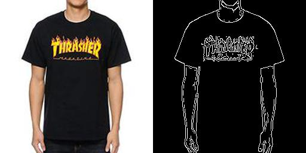

# Workshop pix2pix-glicth generator

WIP

#TODO
- Config file 
- A global start 
- ftp upload ?

This script crops an input image and generate a side by side image for pix2pix

**Input**

**Output**

The preprocess script comes from https://github.com/memo/webcam-pix2pix-tensorflow

## Requirements
 - Python
 - Numpy
 - CV2
 - PIL

## Install 
Idealy inside a docker image

### CPU
> docker run --rm -ti --name pix2pix -v /home/yassin/Documents/pix2pix_glitch_generator/mount:  tensorflow/tensorflow bash

>apt install git

>git clone https://github.com/Pipazoul/pix2pix_glitch_generator.git

>sh install.sh

### GPU

TODO

## To Use

### Get images from google
googleimagesdownload -k keyword -o 1-input -n

### 1- Process the images
Put your pictures in the 1-input folder and in a terminal launch
> sh prepare_dataset.sh

### 2 - Train
> sh train.sh
It will move the files from 3-final to pix2pix/data/input and start the training

### 3- Get ref media and process
youtube-dl -o 1-input youtube_url 

> sh process_media.sh

### 3 - Test
> sh generate.sh

# FAQ

If error "libSM.so.6: cannot open shared object file"

## Nvidia Docker
> apt-get install -y libsm6 libxext6 libxrender-dev

or docker

> apt-get install libglib2.0-0